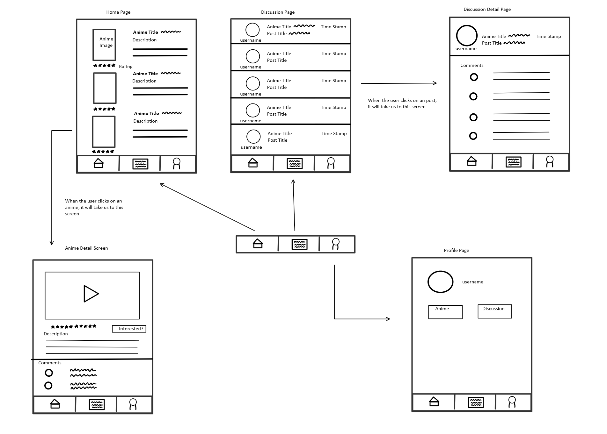

Original App Design Project
===

# AnimeHub 

## Table of Contents
1. [Overview](#Overview)
1. [Product Spec](#Product-Spec)
1. [Wireframes](#Wireframes)
2. [Schema](#Schema)

## Overview
### Description
The goal for this app is to create a place where users can easily browse through a wide selection of anime shows, create their personal list of prefered animes, and discuss with other users of this app about the presented animes

### App Evaluation
[Evaluation of your app across the following attributes]
- **Category:** Entertainment
- **Mobile:** Android
- **Story:** See list of animes and discuss about it
- **Market:** Anime watchers
- **Habit:** Consistent updates on new animes
- **Scope:** A viable project that is presentable on demo day.

## Product Spec

### 1. User Stories (Required and Optional)

**Required Must-have Stories**

* User can see a list of anime
* User can make posts about anime
* User can make comments on posts
* User can select anime to add to their watchlist
* User can see thier own profile which contains thier personalized list of animes and contributions to posts
* ...

**Optional Nice-to-have Stories**

* User can sort anime by category(trending, highly rated, etc.)
* Users can make comments on anime
* User can watch a trailer of the anime
* Users can have profile pictures
* User can see anime that they are interested in
* ...

### 2. Screen Archetypes

* Home Page (Anime list Page)
   * User can view a list of anime
   * User can tap on an anime to go to its **Anime Detail Screen**
   * User can see the navigation bar which contains buttons to go to the **Discussion Page** and **Profile Page**
* Anime Detail Screen
   * A detailed description of each anime is displayed
   * A button can be tapped to add the anime to the user's list of anime
   * *Optional* : User can see comments about the anime 
   * *Optional* : User can watch a trailer of the anime
* Discussion Page
    * User can view the list of posts made about certain animes
    * User can see the name of the original poster,name of anime being discusses, post title and timestamp of the pos
    * User can click on a certain post and be redirected to the **Discussion Detail Page**
* Discussion Detail Page
    * User can see comments made on this post
    * User can respond to the post and make their own comment
* Profile Page
    * User can see all the discussions they have contributed to
    * User can tap on a discussion in the list to view its **Discussion detail Page**
    * *Optional*: User can sort their personalized anime list by rating, trending, etc.
    * *Optional*: User can add a profile picture
    * *Optional:* User can see their own personalized anime list
    * *Optional:* User can tap on the anime in the list to go to its **Anime Detail Screen**
    

### 3. Navigation

**Tab Navigation** (Tab to Screen)

* [Home/Anime List] -> Home Page
* [Discussion] -> Discussion Page
* [Profile] -> Profile Page

**Flow Navigation** (Screen to Screen)

* Home/Anime List
   * Anime Detail Page
* Discussion page
   * Detailed discussion page
* Profile Page
    * Anime Detail Page
    * Discussion Detail Page

## Wireframes
[Add picture of your hand sketched wireframes in this section]

### [BONUS] Digital Wireframes & Mockups

### [BONUS] Interactive Prototype

## Schema 
[This section will be completed in Unit 9]
### Models
[Add table of models]
### Networking
- [Add list of network requests by screen ]
- [Create basic snippets for each Parse network request]
- [OPTIONAL: List endpoints if using existing API such as Yelp]
